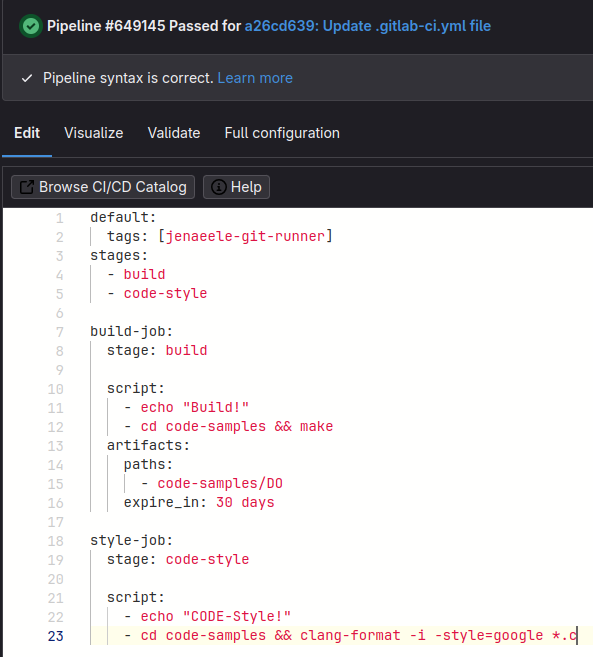
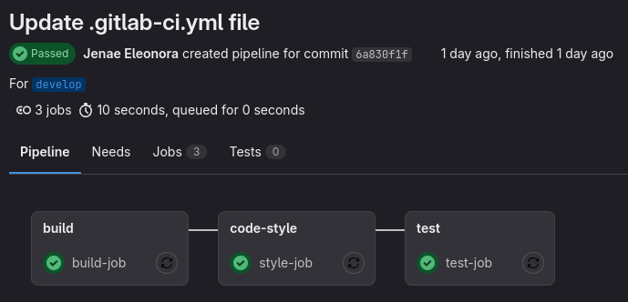
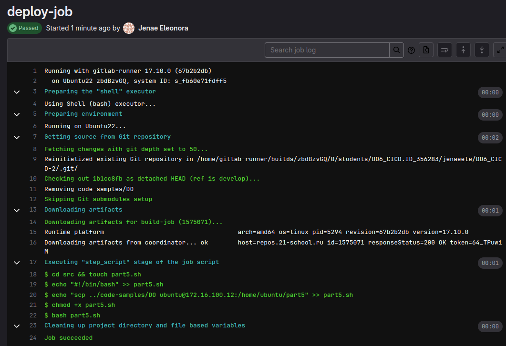

# Basic CI/CD


### Part 1. Настройка **gitlab-runner**

Поднял виртуальную машину *Ubuntu Server 22.04 LTS*.

Скачал и установил на виртуальную машину **gitlab-runner**.
Команды которые использовал для этого:
```bash
curl -L "https://packages.gitlab.com/install/repositories/runner/gitlab-runner/script.deb.sh" | sudo bash

sudo apt install gitlab-runner
```
Для регистрации использовал следующую команду:
```bash
sudo gitlab-runner register
```


### Part 2. Сборка

Поскольку проект *C2_SimpleBashUtils* не выполнен, выполнял проект по сборке приложения из папки code-samples *DO*.

Для выполенения данного задания, предварительно потребовалось установить на виртуальную машину "make" и "gcc"


Написание Pipeline, stage 'build'


Pipeline успешно выполнен.


Stage 'build' успешно выполнен.

### Part 3. Тест кодстайла

Для выполенения данного задания, предварительно потребовалось установить на виртуальную машину "clang-formate"


Написание Pipeline, stage 'code-style'


Pipeline успешно выполнен.


Stage 'code-style' успешно выполнен.


### Part 4. Интеграционные тесты

Поскольку проект *C2_SimpleBashUtils* не выполнен и выполнял проект по сборке приложения из папки code-samples *DO*, то пришлось написать простой тест на Python

Для выполенения этого пункта задания необходимо чтобы на виртуальной машине был установлен Python3


Написание Pipeline, stage 'test'



Pipeline успешно выполнен.


Stage 'test' успешно выполнен.

### Part 5. Этап деплоя

Поднял вторую виртуальную машину *Ubuntu Server 22.04 LTS*.

Для того чтобы написать этап для **CD**, который «разворачивает» проект на другой виртуальной машине, необходимо на этой второй машине установить ssh-сервер.

Далее следует сгенерировать ssh-ключ на первой виртуальной машине и передать его второй виртуальной машине, для этого необходимо использовать следующие команды:

```bash
ssh-keygen

ssh-copy-id ubuntu@172.16.100.12

```
Где 'ubuntu' -это имя пользователя второй виртуальной машины
172.16.100.12 - ip-адрес виртуальной машины

Но поскольку все этапы Pipeline которые выполняются git-runner'ом, выполняются от имени пользователя 'git-runner', следовалельно так же необходимо для этого пользователя создать ключ и передать его на вторую виртуальную машину, команды для этого будут выглядеть следующим образом:

```bash
sudo -u gitlab-runner ssh-keygen

sudo -u gitlab-runner ssh-copy-id ubuntu@172.16.100.12
```


Теперь после передачи ssh-ключа можно копировать файлы с помощью команды scp
```bash
scp /code-samples/DO ubuntu@172.16.100.12:/home/ubuntu/
```


После того как все сделали и протестировали вручную, можно написать sh скрипт и добавить его как этап в Pipeline


Написание Pipeline, stage 'deploy'


Pipeline успешно выполнен.



Stage 'deploy' успешно выполнен.


Убедимся что файл присутствует в конечной дирректории.

### Part 6. Дополнительно. Уведомления

Для настройки Telegram-бота необходимо найти в самом телеграмме бот @BotFather, нажать Старт и далее написать команду /newbot, далее задать имя боту, после этого мы получим ключ API, который далее пригодится нам в скрипте который будем использовать в Pipeline для уведомлений. Так же когда бот будет создан, необходимо перейти по данной ссылке: "https://api.telegram.org/bot<ВАШ_API_ТОКЕН>/getUpdates"  чтобы получить id чата, в который будут приходить непосредственно сами уведомления.

Далее создаем слеедующий bash-скрипт:
```bash
#!/bin/bash

STAGE_TYPE=$1
BOT_TOKEN="тут_API-токен_нашего_бота"
CHAT_ID="тут_id_чата"

sleep 3

if [ "$CI_JOB_STATUS" == "success" ]; then
  MESSAGE="Стадия $STAGE_TYPE $CI_JOB_NAME успешно завершена"
else
  MESSAGE="Стадия $STAGE_TYPE $CI_JOB_NAME завершилась с ошибкой!"
fi

curl -X POST "https://api.telegram.org/bot$BOT_TOKEN/sendMessage" -d chat_id=$CHAT_ID -d text="$MESSAGE"
```
После того как скрипт готов, дополняем наш Pipeline, а именно добавим в конце каждого Stage следующее:
```bash
    after_script:
        - bash src/bot.sh
```


После того как запустим Pipeline, в наш бот начнут приходить уведомления.

